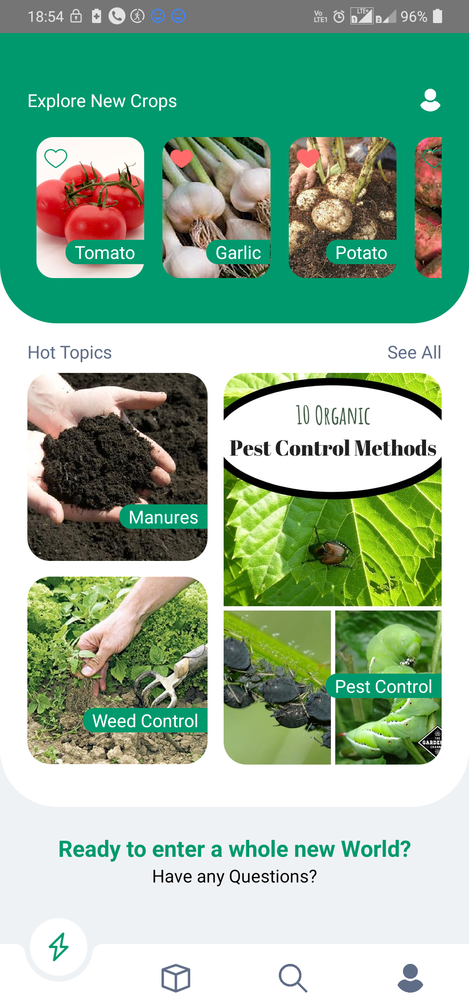

This app 'orgArt' is practicum project of me and <a href="">Abhinav Bhatt</a>. 
This app is and education cum shopping app. 
This app educates you about organic farming from tip to toe and allows you to buy organic foods as well as starter packs and equipments for organic farming. 
This app is built in react native and use firebase as database. 
It is submitted as practicum project in IIIT SONEPAT Copyright &copy 2021 samm.pvt.ltd 
This app is under development.

<h1>ScreenShots</h1>

